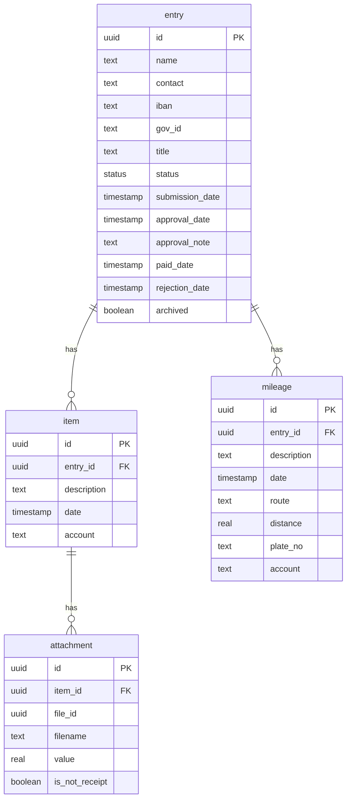

# Guild of Physics' Expense Machine

An expense management system for Fyysikkokilta (Guild of Physics). Users submit expense claims with receipt attachments; admins review, approve, and mark them as paid. Supports regular expense items and mileage claims. Bilingual (Finnish/English).

## Quick Start

```bash
# 1. Clone and install
git clone https://github.com/fyysikkokilta/kulumasiina-v2.git
cd kulumasiina-v2
pnpm install

# 2. Configure environment
cp .env.example .env
# Edit .env — at minimum set DATABASE_URL, GOOGLE_CLIENT_ID, GOOGLE_CLIENT_SECRET, ADMIN_EMAILS

# 3. Set up database
pnpm db:migrate

# 4. Start development server
pnpm dev
```

See [docs/development.md](docs/development.md) for full development setup instructions.

## Documentation

| Guide                                  | Description                                         |
| -------------------------------------- | --------------------------------------------------- |
| [Development](docs/development.md)     | Dev environment, scripts, testing, code conventions |
| [Deployment](docs/deployment.md)       | Docker, production setup, migrations                |
| [OAuth Setup](docs/oauth-setup.md)     | Google OAuth configuration for admin login          |
| [Customization](docs/customization.md) | Branding, translations, environment variables       |

## Expense Workflow Overview

The process works as follows:

1. **Submit** — A user fills in the expense form (contact, IBAN, items and/or mileages, receipt attachments) and submits. An entry is created with status `submitted`.
2. **Admin review** — Admins log in with Google OAuth and see the list of entries. They can filter by status, date, and sort.
3. **Approve or deny** — Admins approve entries (with a note and date) or deny them (with a rejection date). Status becomes `approved` or `denied`.
4. **Mark as paid** — Approved entries can be marked as paid (with a payment date). Status becomes `paid`.
5. **Archive** — Entries can be archived. Old archived entries can be deleted automatically based on configurable age.
6. **Export** — PDF and CSV export per entry; bulk ZIP export for multiple entries. Used for bookkeeping and records.

## Database Schema

The diagram below reflects the schema defined in `src/db/schema.ts` (Drizzle ORM, PostgreSQL).



## About

[Guild of Physics' Expense Machine](https://kulu.fyysikkokilta.fi)

**Topics:** typescript, nextjs, drizzle-orm, expense-management
